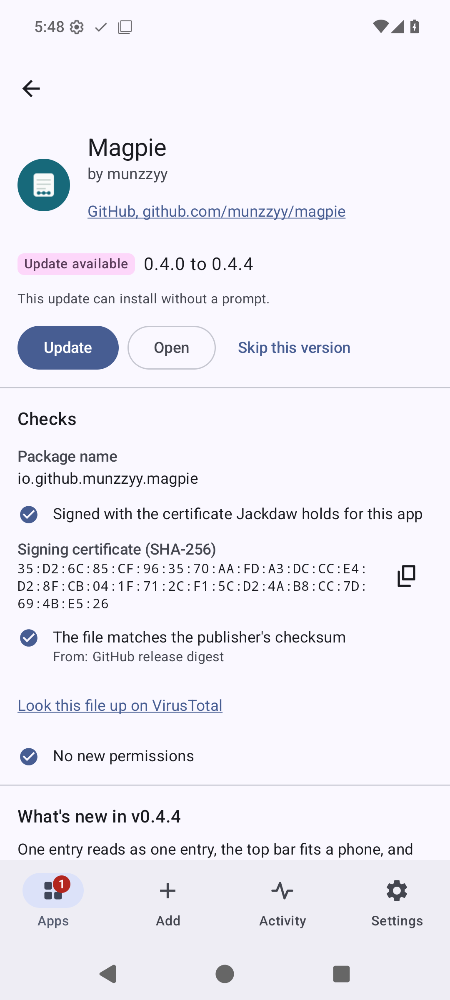
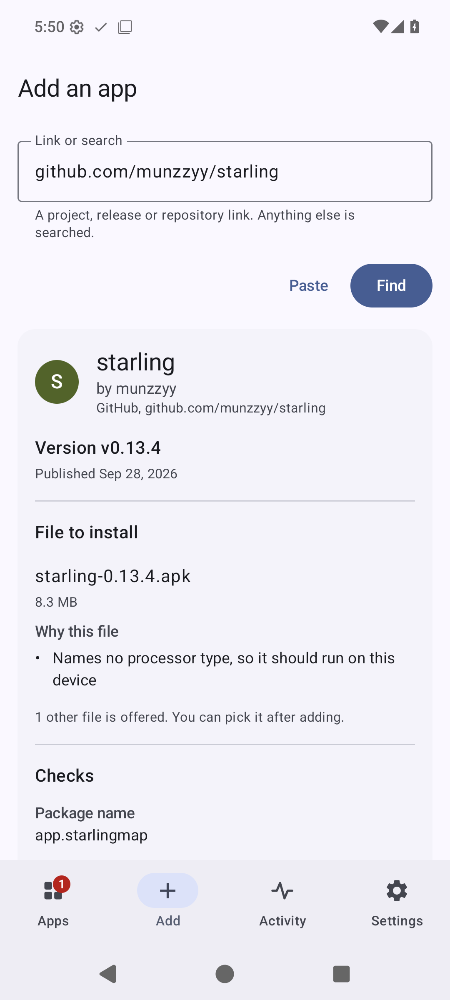
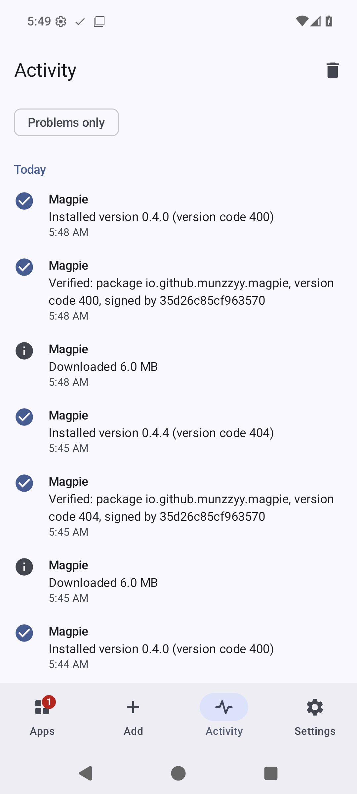

# Tern

Android apps, straight from where their developers publish them, checked before they install.

Most open source Android apps put their releases on GitHub, GitLab, Codeberg or a
repository of their own, days before any store carries them, if a store ever does.
[Obtainium](https://github.com/ImranR98/Obtainium) showed that a phone can follow
those release pages by itself. Tern does that job too, and then it looks hard at
what it was handed: who signed the file, whether it is the app you asked for, and
whether it matches the checksum the publisher gave. Only then does Android's
installer see it.

It is a native app of about 4 MB, with no analytics and no account. It talks to
the sources you add and to nobody else.

<p align="center">
  
  
  
</p>

## What it checks

Before it downloads anything, Tern reads the file's own package name, version
code and signing certificate off the server with a handful of range requests. For
a 6 MB file that took 4 requests and 106 KiB. What it reads there is a claim, and
the screen says "claims" until Android has confirmed it.

After the download:

1. The file's SHA-256 is compared with the publisher's checksum when there is one:
   GitHub's release digest, a signed F-Droid index, a `.sha256` file next to the
   download, a `SHA256SUMS` file, or a hash in the release notes.
2. The file is read twice, by Tern's parser and by Android's. If the two disagree
   about what the file is, it is refused.
3. The signer has to be the signer of the app you already have, and the one pinned
   for it. The pin is set from the first install and travels with your exports, so
   a reinstall on a new phone is held to the same certificate.
4. A file for another package, an older version than the installed one, or a
   test-only build is refused.

An install counts when Android says it succeeded and the package manager then
shows the new version code. Until both are true the app's row says what is
really on the phone.

For a file whose SHA-256 is known, the same panel links to the file's page on
VirusTotal. Your browser opens it. Tern uploads nothing and needs no key.

## Where it looks

| Source | What is read |
|---|---|
| GitHub | The release feed first, the API only when the feed changed |
| GitHub Actions | Artifacts of the latest successful run of a workflow (needs a token) |
| GitLab | gitlab.com and self-hosted instances |
| Forgejo, Gitea | Codeberg and self-hosted instances |
| F-Droid, IzzyOnDroid | Their per-app listings |
| Any F-Droid format repository | The signed index, with the repository's key pinned |
| A web page | Links to installable files, with optional steps through other pages |
| A direct link | One file at a fixed address, whether or not the address ends in a file name |
| Jenkins, SourceHut, SourceForge | The last successful build, tags, the project's files |

Paste a link, or share one from the browser, and Tern works out which of
these it is.

Mirror sites and sites that repack other people's apps are left out on purpose.
Tern follows the developer, and a mirror is somebody else.

## Updates without a prompt

Before the very first install, Android wants to hear from you that Tern may
install apps. Tern asks before it starts, opens the right page of the system
settings, and carries on with the install when you come back.

The first install of any app asks once, as Android requires. After that Tern
asks Android for a silent update every time and does what the system answers.
On Android 12 and newer, for an app Tern installed, that is normally a silent
update; where Android wants a confirmation you get a notification instead of a
surprise. Android refuses a second silent update of the same app within 30
seconds of the last one, and that is one of the cases where you are asked.

Checks run every six hours by default, through Android's own job scheduler, and
the schedule is put back after a reboot and after Tern itself is updated. You
can limit them to unmetered networks or to charging, and choose per app between
being told, updating automatically, and never checking in the background. If you
force stop Tern, Android drops the schedule until you open the app again.

## Coming from Obtainium

Import its export file under Settings. Apps from sources Tern carries come
over with their filters, categories and pinned certificates. The rest are listed
by name with the reason, so you know what to look for elsewhere. Apps that
arrive with a pinned certificate or a filter are named in the summary, because
those are settings somebody else chose.

You can also start from the repositories you starred on GitHub: give a user
name, tick the ones that are apps, and Tern adds them one by one.

Tern can also open `obtainium://` links, which is how the
[crowdsourced configurations](https://apps.obtainium.imranr.dev/) are shared.
That is off until you turn it on in Settings, and a link only ever fills in the
Add screen: nothing is stored or installed until you press the button.

## Languages and screens

Tern comes in English and 28 other languages, right-to-left ones included.
The translations were made by a machine and checked by a second one; no native
speaker has reviewed them yet, and corrections are welcome. On Android 13 and
later you pick the language under Settings, apart from the phone's own.

It works on phones, tablets and Android TV. On a television every screen can be
used with the remote alone. Text at twice the normal size keeps each screen's
main action on screen.

## How it compares

[docs/COMPARISON.md](docs/COMPARISON.md) goes through it point by point, with the
file and line in Obtainium's source or the issue number for each claim about it,
and the test or measurement for each claim about Tern. It also lists what
Obtainium does that Tern does not.

## What it does not do

- It installs through Android's own installer only. There is no Shizuku and no
  root mode, so a first install always asks, and silent updates need Android 12.
- The translations are machine-made. Details of an error that come from a
  server or a parser stay in English, and an entry in the activity log stays in
  the language it was written in.
- It has run on an Android 16 phone emulator and an Android TV 14 emulator, not
  yet on a shelf of real devices. Vendor installers, Doze over many hours, a
  reboot and a real Orbot are untested. On the television image Play Protect
  stopped the first install of an app it had not seen and offered "Install
  anyway"; that answer is yours to give.
- F-Droid and IzzyOnDroid are read through their per-app listings, which are
  protected by TLS and not by the index signature. Add either as a repository by
  its address if you want the signature checked; the first contact then downloads
  the whole index, 19 MB for F-Droid, and later changes cost a diff.
- A filter pattern that takes too long to match is stopped after half a second
  and reported, but the thread it ran on keeps spinning until Android ends the
  app's process.
- There is no release yet, and it is not in any store.

## Build it

```sh
export ANDROID_HOME=~/Android/Sdk
./gradlew :app:assembleRelease
bash tools/check-apk.sh app/build/outputs/apk/release/app-release-unsigned.apk
```

You need JDK 21 and the Android SDK with platform 37. The result is unsigned;
[docs/RELEASING.md](docs/RELEASING.md) covers signing.

## Check the claims

`./gradlew :core:test` runs the parsers, the sources and the update decision on
the JVM, against fixtures built by Google's own tools, so the oracle for an APK's
package, version and certificate is `aapt2` and `apksigner` and not Tern.

`./gradlew :core:test -Dtern.live=true --tests '*LiveSmokeTest*'` runs the
same code against GitHub, F-Droid, Codeberg and GitLab. It reads public data and
sends no credentials.

`./gradlew :app:connectedDebugAndroidTest` needs an emulator or a phone. It
installs a test app through Tern, publishes a new version, and checks that the
update arrives without a prompt; then it offers the same update signed by another
key and checks that the installer is never called. It also cuts downloads
mid-way, redirects a request with a token to another host, and hands the gate
files that were altered after signing.

`tools/check-apk.sh` reads the built APK and fails if its permissions differ from
the list in the script, if cleartext traffic is allowed anywhere, if it is
debuggable, if it is over 5 MiB, or if test code reached it.

`python3 tools/strings.py check app/src/main/res` compares every translation
with the English: the same placeholders, the plural forms the language needs,
nothing that exists in one and not the other.

## Licence

GPL-3.0-or-later. See [LICENSE](LICENSE).

Tern contains no code from Obtainium. It reads Obtainium's export format so
that people can move, and it owes the idea to Imran Remtulla's app.
