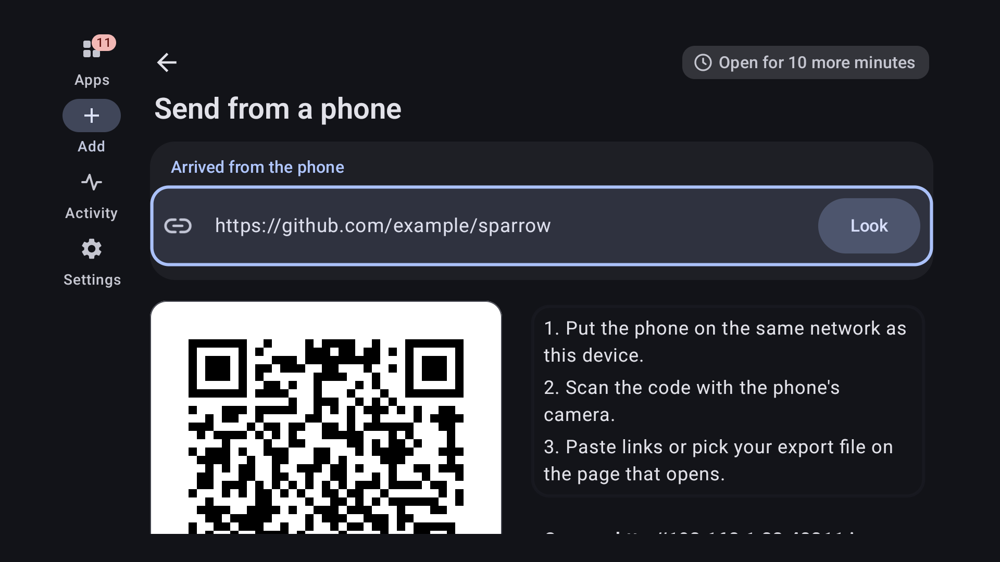

# Tern

[](https://github.com/munzzyy/tern/releases/latest)
[](https://github.com/munzzyy/tern/actions/workflows/ci.yml)
[](LICENSE)

Android apps, straight from where their developers publish them, checked before they install.

Most open source Android apps put their releases on GitHub, GitLab, Codeberg or a
repository of their own, days before any store carries them, if a store ever does.
[Obtainium](https://github.com/ImranR98/Obtainium) showed that a phone can follow
those release pages by itself. Tern does that job too, and then it looks hard at
what it was handed: who signed the file, whether it is the app you asked for, and
whether it matches the checksum the publisher gave. Only then does Android's
installer see it.

It is a native app of about 7 MB, with no analytics and no account. It talks to
the sources you add and to nobody else. [PRIVACY.md](PRIVACY.md) says what
leaves the device.

- Every signature is verified twice: by Tern's own verifier and by Android.
- Each app stays tied to the certificate of its first install. For 15
  well-known apps Tern knows the certificate before that.
- It reads every source Obtainium reads, from GitHub to the Galaxy Store, and
  installs through Android, Shizuku, Dhizuku, root or another installer app.
- A widget, a Quick Settings tile and launcher shortcuts check and update from
  outside the app.
- Android TV works by remote, and a phone can send links to it sealed with a
  code the TV shows.
- With Orbot chosen, everything goes through Tor and nothing goes around it.
- An Obtainium export brings your list and your settings along, and Tern can
  write one for Obtainium too.

[](https://munzzyy.github.io/tern/add/?url=https%3A%2F%2Fgithub.com%2Fmunzzyy%2Ftern)

Or download `tern.apk` from the [latest release](https://github.com/munzzyy/tern/releases/latest).
It runs on Android 10 and later, on phones, tablets and TVs. Once it is
installed, the badge above adds Tern to itself, so it keeps itself up to date.

<p align="center">
  
  
  
</p>

## What it checks

Before it downloads anything, Tern reads the file's own package name, version
code and signing certificate off the server with a handful of range requests. For
a 6 MB file that took 4 requests and 106 KiB. What it reads there is a claim, and
the screen says "claims" until Android has confirmed it.

After the download:

1. The file's SHA-256 is compared with the publisher's checksum when there is one:
   GitHub's release digest, a signed F-Droid index, a `.sha256` file next to the
   download, a `SHA256SUMS` file, or a hash in the release notes.
2. The signature is verified twice, by Tern's own verifier (APK Signature Scheme
   v1, v2, v3 and v3.1) and by Android. If the two disagree about who signed the
   file, it is refused. Android does not read every part of a split bundle on
   every version, and a part it skips has to pass Tern's check alone.
3. The signer has to be the signer of the app you already have, and the one pinned
   for it. The pin is set from the first install and travels with your exports, so
   a reinstall on a new phone is held to the same certificate. For 15 well-known
   apps Tern carries the developer's certificate itself, each one confirmed by a
   second source, so even their first install is checked.
4. A file for another package, an older version than the installed one, or a
   test-only build is refused.

An install counts when Android says it succeeded and the package manager then
shows the new version code. Until both are true the app's row says what is
really on the phone. [docs/SECURITY-MODEL.md](docs/SECURITY-MODEL.md) says who is
trusted with what, and where each check ends.

For a file whose SHA-256 is known, the same panel links to the file's page on
VirusTotal. Your browser opens it. Tern uploads nothing and needs no key. When
[AppVerifier](https://github.com/soupslurpr/AppVerifier) is installed, an app's
page also offers a second check there, against AppVerifier's own list.

## Where it looks

| Source | What is read |
|---|---|
| GitHub | The release feed first, the API only when the feed changed |
| GitHub Actions | Artifacts of the latest successful run of a workflow (needs a token) |
| GitLab | gitlab.com and self-hosted instances |
| Forgejo, Gitea | Codeberg and self-hosted instances |
| F-Droid, IzzyOnDroid | Their per-app listings |
| Any F-Droid format repository | The signed index, with the repository's key pinned |
| A web page | Links to installable files, with optional steps through other pages |
| A direct link | One file at a fixed address, whether or not the address ends in a file name |
| Jenkins, SourceHut, SourceForge | The last successful build, tags, the project's files or one folder of them |
| Huawei AppGallery, Samsung Galaxy Store, vivo, Tencent, RuStore, CoolApk, itch.io | Each store's own app record; the Galaxy Store with the device model and CSC of your choice |
| Telegram, NeutronCode | Their own release channels |
| APKPure, Aptoide, Uptodown, APKCombo, APKMirror, Farsroid | Stores that offer again what developers publish elsewhere (APKMirror for tracking only) |
| LiteAPKs, Apk4Free, RockMods | Sites that offer apps changed by someone else (RockMods for tracking only) |

Paste a link, or share one from the browser, and Tern works out which of
these it is. Searching by name looks in the forges, F-Droid and the stores
you pick.

Tern follows the developer, so it says so before you add an app from a store
that republishes other people's apps, and it says plainly when a site offers
apps someone else changed. Whatever the source, a file is held to the
certificate of the app you have, and to the pinned one.

## Updates without a prompt

Before the very first install, Android wants to hear from you that Tern may
install apps. Tern asks before it starts, opens the right page of the system
settings, and carries on with the install when you come back.

The first install of any app asks once, as Android requires. After that Tern
asks Android for a silent update every time and does what the system answers.
On Android 12 and newer, for an app Tern installed, that is normally a silent
update; where Android wants a confirmation you get a notification instead of a
surprise. Android refuses a second silent update of the same app within 30
seconds of the last one, and that is one of the cases where you are asked.

With Shizuku, Dhizuku or root chosen under Settings, Installing, first installs
and updates install without a prompt on any Android from 10 on. Android then
names Dhizuku as the installer, and may show its own notice that an admin
installed the app. You can also hand
every checked file to another installer app; Tern then compares the signer of
what it installed with the file it checked.

Checks run every six hours by default, and anywhere from every 15 minutes to
every 30 days, through Android's own job scheduler. The schedule is put back
after a reboot and after Tern itself is updated. You can limit them to unmetered
networks or to charging, check when Tern opens or when an app's page opens, and
choose per app between being told, updating automatically, and never checking
in the background. If you force stop Tern, Android drops the schedule until you
open the app again.

## Outside the app

A widget on the home screen says how many updates there are, with a Check
button and an Update all button. A Quick Settings tile checks and shows the
count, and the launcher icon's shortcuts check, update everything or add an app.
Notifications about updates carry an Update button of their own.

## Through Tor

Choose Orbot under Settings, Network, and every request Tern makes goes through
Orbot's proxy, names included. If the proxy is not there, the request fails and
says so. Nothing goes round it, and tests on a device hold it to that for checks,
downloads and icons. The same row shows whether Orbot is connected and opens it
when it is not.

## On a television

Every screen works with the remote alone. A TV has no file picker, so exports go
to `Download/Tern` and imports come from a list, an address or a phone. Choose
Send from a phone and the TV shows a QR code and a code of 20 characters. The
phone's browser seals the links or the export file with that code before they
leave the phone, and the TV opens only what was sealed with it. Nothing is added
until you look at it on the TV. [docs/TELEVISION.md](docs/TELEVISION.md) has the
details.

<p align="center">
  
</p>

## Coming from Obtainium

Import its export file under Settings. Apps come over with their filters,
categories, notes and pinned certificates, and the settings in the file come
along under Tern's names: the interval, the list's order and grouping, the
theme and the colours of the categories. Tokens and the installer never travel
in a file. Apps that arrive with a pinned certificate or a filter are named in
the summary, because those are settings somebody else chose. Going the other
way, Settings writes a file Obtainium imports.

You can also start from the repositories you starred on GitHub: give a user
name, tick the ones that are apps, and Tern adds them one by one.

Tern can also open `obtainium://` links, which is how the
[crowdsourced configurations](https://apps.obtainium.imranr.dev/) are shared.
That is off until you turn it on in Settings, and a link only ever fills in the
Add screen: nothing is stored or installed until you press the button.

## A badge for your own app

If you publish an Android app on GitHub or anywhere else Tern reads, a badge in
your README lets people add it to Tern with one tap:

```markdown
[](https://munzzyy.github.io/tern/add/?url=https%3A%2F%2Fgithub.com%2FYOU%2FYOUR-APP)
```

The [site](https://munzzyy.github.io/tern/) writes this line for you from your
address. The link opens a small page that hands the address to Tern, which
shows the app first and adds nothing until the person presses Add. Without Tern
the page offers the download.

## Languages and screens

Tern comes in English and 28 other languages, right-to-left ones included.
The translations were made by a machine and checked by a second one; no native
speaker has reviewed them yet, and corrections are welcome. On Android 13 and
later you pick the language under Settings, apart from the phone's own.

Text at twice the normal size keeps each screen's main action on screen, on a
phone and on a TV. The look is yours to change under Settings, Look: the theme,
colours from the wallpaper, a palette or a colour of your own, contrast,
density, corners and the shape of app icons.

## How it compares

[docs/COMPARISON.md](docs/COMPARISON.md) goes through it point by point, with the
file and line in Obtainium's source or the issue number for each claim about it,
and the test or measurement for each claim about Tern. It also lists what
Obtainium does that Tern does not.

## What it does not do

- Without Shizuku, Dhizuku or root, a first install always asks, and silent
  updates need Android 12, as Android decides.
- An archive compressed with zstd is not opened; zip, tar, and tar compressed
  with gzip, bzip2 or xz are.
- The translations are machine-made. Details of an error that come from a
  server or a parser stay in English, and an entry in the activity log stays in
  the language it was written in.
- It has run on emulators: Android 10, 13 and 16 phones and Android TV 11 and
  14. It has not yet run on a shelf of real devices. Vendor installers, Doze over
  many hours and a reboot are untested. On the television image Play Protect
  stopped the first install of an app it had not seen and offered "Install
  anyway"; that answer is yours to give.
- F-Droid and IzzyOnDroid are read through their per-app listings, which are
  protected by TLS and not by the index signature. Add either as a repository by
  its address if you want the signature checked; the first contact then downloads
  the whole index, 19 MB for F-Droid, and later changes cost a diff.
- A filter pattern that takes too long to match is stopped after half a second
  and reported, but the thread it ran on keeps spinning until Android ends the
  app's process.
- It is not in any store yet.

## Build it

```sh
export ANDROID_HOME=~/Android/Sdk
./gradlew :app:assembleRelease
bash tools/check-apk.sh app/build/outputs/apk/release/app-release-unsigned.apk
```

You need JDK 21 and the Android SDK with platform 37. The result is unsigned;
[docs/RELEASING.md](docs/RELEASING.md) covers signing.

## Check the claims

`./gradlew :core:test` runs the parsers, the sources and the update decision on
the JVM, against fixtures built by Google's own tools, so the oracle for an APK's
package, version and certificate is `aapt2` and `apksigner` and not Tern.

`./gradlew :core:test -Dtern.live=true --tests '*LiveSmokeTest*'` runs the
same code against GitHub, F-Droid, Codeberg and GitLab. It reads public data and
sends no credentials.

`bash tools/device-suite.sh <serial>` runs the device tests on an emulator or a
phone, after `./gradlew :app:assembleDebug :app:assembleDebugAndroidTest`. They
install a test app through Tern, publish a new version, and check that the
update arrives without a prompt; then they offer the same update signed by
another key and check that the installer is never called. They also cut
downloads mid-way, redirect a request with a token to another host, hand the
gate bundles that were altered after signing, and send checks through a proxy
that is not there. Gradle's own connected task is not used, because it drops a
permission that old Android versions only take from the host.

`bash tools/check-handoff-page.sh` runs the handoff page's own ChaCha20, SHA-256
and HMAC against the RFC test vectors in node, then sends links and files from a
real Chromium to a live handoff and checks that the page broke no rule of its
Content-Security-Policy.

`bash tools/check-network-doors.sh` fails if any code other than the one HTTP
client opens a connection or resolves a name on the device.

`bash tools/check-reproducible.sh <folder>` builds the release twice from two
clones in different places and compares the files byte for byte.

`tools/check-apk.sh` reads the built APK and fails if its permissions differ from
the list in the script, if cleartext traffic is allowed anywhere, if it is
debuggable, if it is over 7 MiB, or if test code reached it.

`python3 tools/strings.py check app/src/main/res` compares every translation
with the English: the same placeholders, the plural forms the language needs,
nothing that exists in one and not the other.

## Taking part

Bugs and ideas go to the [issue tracker](https://github.com/munzzyy/tern/issues),
and [CONTRIBUTING.md](CONTRIBUTING.md) has the setup and the house rules. A
security problem goes to me privately first, as [SECURITY.md](SECURITY.md)
describes.

## Licence

GPL-3.0-or-later. See [LICENSE](LICENSE).

Tern contains no code from Obtainium. It reads Obtainium's export format so
that people can move, and it owes the idea to Imran Remtulla's app.
